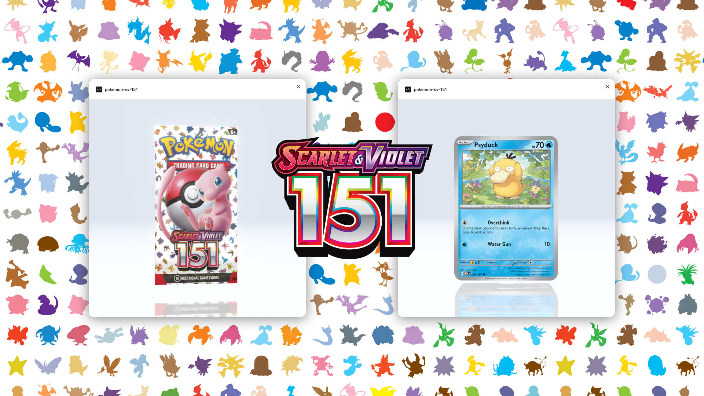

# Pokémon SV-151 — Figma Plugin

**Pokémon Scarlet & Violet 151 Card Pack Opener**  
A fully interactive pack-opening experience right inside Figma — complete with realistic pull rates, foils, sparkles, and every card from the iconic 151 set.

 

## Overview

**pokemon-sv-151** is a Figma plugin that lets you open virtual Pokémon TCG: *Scarlet & Violet – 151* packs directly in your design environment.  
Whether you’re prototyping a collectible experience, showing off motion effects, or just having fun, this plugin brings the thrill of opening booster packs to your canvas.  

**Collect ’em all — right inside Figma!**

## Features

- **All 360 Cards Included**  
  Every card from the *Scarlet & Violet 151* set, fully categorized and render-ready.

- **Realistic Pull Rates**  
  Each pack simulates authentic booster odds — from commons to secret rares.

- **Foils & Sparkles**  
  Cards can appear with shiny foil and sparkle effects for extra excitement.

- **Animated Pack Reveal**  
  Smooth, cinematic animations for each pack pull.

## How It Works

1. **Run the plugin** in Figma → search for `pokemon-sv-151`.
2. Click the pack to reveal a randomized set of cards.
3. Enjoy the foil effects and sparkles.

## Data

- Includes all **360 cards** from the *SV151* set.  
- Categorized by rarity, type, and collector number.  
- Based on real-world **pull rates** from official TCG data.

## Installation

1. Open Figma → **Plugins → Browse Plugins in Community**  
2. Search **pokemon-sv-151”**  
3. Click **Install**  
4. Run it from **Plugins → pokemon-sv-151**

## Development

```bash
git clone https://github.com/erikdotdesign/pokemon-sv-151.git
cd pokemon-sv-151
npm install
npm run dev
Load the manifest.json into Figma → Plugins → Development → Import plugin from manifest…
```

This plugin is built with:  
- [React.js](https://react.dev/)
- [TypeScript](https://www.typescriptlang.org/)
- [Three.js](https://threejs.org/) for 3D rendering  
- [React-three-fiber](https://r3f.docs.pmnd.rs/getting-started/introduction) for 3D rendering
- [React-three-drei](https://drei.docs.pmnd.rs/getting-started/introduction) for 3D rendering
- [React-three-spring](https://www.react-spring.dev/docs/guides/react-three-fiber) for 3D animations
- [Figma Plugin API](https://www.figma.com/plugin-docs/)

## License 

MIT

*Not affiliated with or endorsed by The Pokémon Company International.*